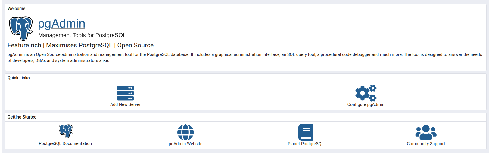

# Forma Livre

Este repositório contém o código fonte do projeto **Forma Livre**.

A demonstração em video pode ser vista aqui: https://youtu.be/pJNl5fiPIGU


## Estrutura do projeto

A implementação do backend, frontend e queries necessárias para construção do banco de dados estão contidos em seus
respectivos diretórios. O frontend foi desenvolvido utilizando o framework React, o backend em NodeJS com ExpressJS e o
banco de dados Postgres.

Para agilizar o desenvolvimento, os componentes do projeto estão dockerizados (rodando em container Docker). O
docker-compose foi incluido para montagem dos conteineres e roteamento (através da rede interna do Docker).


## Como executar o projeto

### Crie a rede interna do Docker

```sh
docker network create formalivrenet
```

### Inicie os serviços

```sh
docker compose build --up
```

Cada serviço/componente do projeto estará disponível em uma porta diferente:

- Frontend: `http://localhost:8080`
- Backend: `http://localhost:10999`
- Banco de dados (postgres): `http://localhost:5432`
- Console web de gerenciamento do banco de dados (pgadmin): `http://localhost:15432`

### Crie as tabelas do banco

Acesse o `pgadmin` pelo endereço `http://localhost:15432`. Na tela de login, insira o usuário `alexya@alexya.com` e a
senha `loremipsum`. Clique em "Login".


No dashboard da página inicial, clique em "Add New Server".



No popup que se abrir, dê um nome à conexão.


Na aba "connection", coloque o host como "forma-livre-database" (endereço interno do Docker), usuário `postgres` e senha
`postgres`. Clique em "Save".


Na parte lateral esquerda da página (browser), expanda até que o banco de dados `postgres` seja encontrado.


Clique com o botão direito em cima do banco de dados `postgres` e então clique em "Query Tool".


Copie o SQL contido no diretório (neste projeto) "database" e cole no campo aberto. Depois clique no botão de "play"
para executar as queries.


### Acesse o frontend

No navegador, acesse via `http://localhost:8080`
